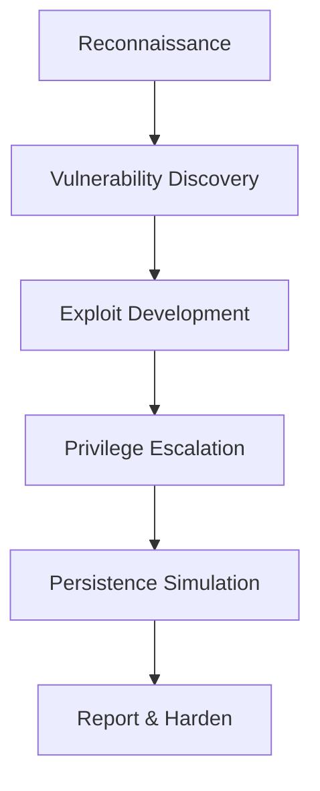

# 👨‍💻 Funbin

---

## 🧠 About Me

I’m **Funbin**, a cybersecurity researcher, red team operator, and automation enthusiast. I script, test, and fortify — from reconnaissance to post-exploitation — with ethical precision and technical rigor.

💀 **Core Focus:** Penetration Testing | Red Teaming | Ethical Hacking | Bash/Python Automation
💬 **Ask Me About:** Payload automation, shell scripting, system hardening, or custom tool creation
🎯 **Mission:** Craft resilient systems by understanding their weaknesses
⚡ **Fun Fact:** I automate everything

---

## 🧩 Languages & Skills

---

## ⚙️ My Workflow

**Philosophy:** Understand systems like an attacker, defend them like an engineer.

---

## 📊 GitHub Stats

## 🧮 Contribution Graph

---

## 🛠️ Toolset & Frameworks

     

---

## 📬 Contact

📧 Email: [yourname@domain.com](mailto:funbinet@gmail.com)
🐙 GitHub: [Funbin](https://github.com/funbinet)

---

## Signature

> — Funbin
