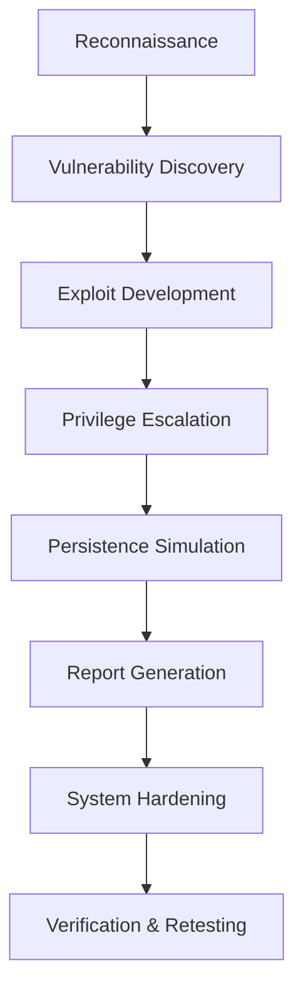

  

<h1 align="center">FUNBINET</h1>

  

 
   
  

<h3 align="center">ABOUT ME</h3>

 I am a Computer Science student at Chuka University specializing in Cybersecurity. My work focuses on the intersection of offensive security and automation. I develop custom toolsets and frameworks designed to streamline reconnaissance, vulnerability assessment, and post-exploitation workflows. 

 <strong>Academic Focus:</strong> B.Sc. in Computer Science (Chuka University)

 <strong>Specialization:</strong> Red Teaming, Penetration Testing, and Bash/Python Automation 

 <strong>Top Projects:</strong> <a href="https://codeberg.org/funbinet">Leviathan & Omnisec</a> 

<h3 align="center">LANGUAGES AND SKILLS</h3>

      
 
      

<h3 align="center">SECURITY TOOLSET</h3>

      

<h3 align="center">TECHNICAL WORKFLOW</h3>

<h3 align="center">ACTIVITY AND ENGAGEMENT</h3>

  

  

<h3 align="center">CONTACT AND VERIFICATION</h3>

 <strong>Email:</strong> <a href="mailto:funbinet@gmail.com">funbinet@gmail.com</a> 

 <strong>Primary Development:</strong> <a href="https://codeberg.org/funbinet">Codeberg/funbinet</a> 

 <strong>Legacy Mirrors:</strong> <a href="https://github.com/funbinet">GitHub/funbinet</a> 

  

