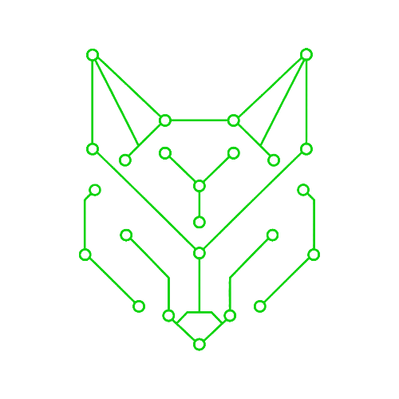

<div align="center">
<p>  </p>


<a href="https://github.com/funbinet">
  
</a>

<p align="center">
  <a href="https://github.com/funbinet">
    
  </a>
  <a href="https://codeberg.org/funbinet">
    
  </a>
  <a href="mailto:funbinet@gmail.com">
    
  </a>
  <a href="https://github.com/funbinet?tab=followers">
    
  </a>
</p>

<p align="center">
  
  
  
</p>

</div>

<br/>

---

<br/>


<p align="center">
  
</p>

<table align="center" width="100%" border="0" cellspacing="0" cellpadding="8">
<tr>
<td width="55%" valign="top">

```yaml
name:       Dancan Dominic
role:       IAM Engineer
focus:      Identity Security · Access Governance · Automation
degree:     B.Sc. Computer Science
location:   Kenya
```

I design, automate, and defend **identity systems**, the layer every
organisation trusts to answer two questions: *Who are you?* and *What are
you allowed to do?*

My background in offensive security gives me an attacker's eye. I now apply
that same adversarial mindset to **building identity infrastructure that
resists abuse**, not just detecting it after the fact.

</td>
</tr>
</table>

<br/>

---

<br/>


<p align="center">
  
</p>

<table align="center" width="100%" border="0" cellspacing="4" cellpadding="6">
<tr>
<td align="center" width="25%">
  
  <br/><sub>Entra ID · AWS IAM · Keycloak<br/>Samba AD · LDAP · Kerberos</sub>
</td>
<td align="center" width="25%">
  
  <br/><sub>OAuth 2.0 · OIDC · SAML 2.0<br/>JWT · PKCE · Client Credentials</sub>
</td>
<td align="center" width="25%">
  
  <br/><sub>RBAC · ABAC · Least Privilege<br/>JML Lifecycle · Access Reviews</sub>
</td>
<td align="center" width="25%">
  
  <br/><sub>MFA · Conditional Access<br/>Detection · Incident Response</sub>
</td>
</tr>
</table>

<br/>

---

<br/>


<p align="center">
  
</p>

<p align="center"><sub><b>IDENTITY PLATFORMS</b></sub></p>

<p align="center">
  
  
  
  
  
</p>

<p align="center"><sub><b>LANGUAGES & AUTOMATION</b></sub></p>

<p align="center">
  
  
  
  
  
</p>

<p align="center"><sub><b>INFRASTRUCTURE & TOOLING</b></sub></p>

<p align="center">
  
  
  
  
  
</p>

<p align="center"><sub><b>SECURITY TOOLSET</b></sub></p>

<p align="center">
  
  
  
  
  
</p>

<br/>

---

<br/>


<p align="center">
  
</p>

<table align="center" width="100%" border="0" cellspacing="10" cellpadding="10">
<tr>
<td width="50%" valign="top">

<h3 align="center">IAM Lifecycle Automation</h3>

<p align="center">
  
  
  
</p>

<p align="center"><sub>A CLI tool that onboards, transfers, and offboards identities from a single CSV source of truth.</sub></p>

<p align="center">
  <code>Dry-run mode</code> · <code>Department-based groups</code><br/>
  <code>Structured audit logging</code> · <code>Idempotency tests</code><br/>
  <code>Unit tests</code> · <code>Architecture diagram</code>
</p>

<p align="center">
  <a href="https://github.com/funbinet/iam">
    
  </a>
</p>

</td>
<td width="50%" valign="top">

<h3 align="center">Enterprise SSO Lab</h3>

<p align="center">
  
  
  
</p>

<p align="center"><sub>A working web application that authenticates through OpenID Connect and enforces role-based access on every API endpoint.</sub></p>

<p align="center">
  <code>Roles: admin · analyst · viewer</code><br/>
  <code>Auth Code + PKCE flow</code> · <code>Protected endpoints</code><br/>
  <code>Token expiry handling</code> · <code>SSO troubleshooting guide</code>
</p>

<p align="center">
  <a href="https://github.com/funbinet/iam">
    
  </a>
</p>

</td>
</tr>
<tr>
<td width="50%" valign="top">

<h3 align="center">Identity Security Operations</h3>

<p align="center">
  
  
  
</p>

<p align="center"><sub>Detection rules and response playbooks for identity-layer attacks, written against a live lab environment.</sub></p>

<p align="center">
  <code>Suspicious sign-in detection</code><br/>
  <code>MFA fatigue &amp; password spraying</code><br/>
  <code>Privilege escalation via groups</code> · <code>Incident report</code><br/>
  <code>Remediation + verification</code>
</p>

<p align="center">
  <a href="https://github.com/funbinet/iam">
    
  </a>
</p>

</td>
<td width="50%" valign="top">

<h3 align="center">Cloud IAM Policy Lab</h3>

<p align="center">
  
  
  
</p>

<p align="center"><sub>Ten documented AWS IAM policies written to demonstrate progressive least-privilege design.</sub></p>

<p align="center">
  <code>Identity vs resource policies</code><br/>
  <code>Permission boundaries</code> · <code>Trust policies</code><br/>
  <code>AssumeRole with STS</code> · <code>MFA conditions</code><br/>
  <code>Before / after access comparison</code>
</p>

<p align="center">
  <a href="https://github.com/funbinet/iam">
    
  </a>
</p>

</td>
</tr>
</table>

<br/>

---

<br/>

<p align="center">
  
</p>

<p align="center">
  
</p>

<p align="center">
  <picture>
    <source media="(prefers-color-scheme: dark)" srcset="https://raw.githubusercontent.com/funbinet/funbinet/output/github-snake-dark.svg"/>
    <source media="(prefers-color-scheme: light)" srcset="https://raw.githubusercontent.com/funbinet/funbinet/output/github-snake.svg"/>
  </picture>
</p>

<br/>

---

<br/>


<p align="center">
  
</p>

<p align="center">
  <em>"Identity is the new perimeter. Every access decision is a security<br/>
  decision, and every security decision must be provable."</em>
</p>

<p align="center">
  I build identity systems the same way I approach a penetration test:<br/>
  <strong>assume nothing, verify everything, document the evidence.</strong><br/>
  The difference is that now I am on the side that ships the fix, not the finding.
</p>

<br/>

---

<br/>


<p align="center">
  
</p>

<table align="center" width="100%" border="0" cellspacing="4" cellpadding="6">
<tr>
<td align="center" width="25%">
  
</td>
<td align="center" width="25%">
  
</td>
<td align="center" width="25%">
  
</td>
<td align="center" width="25%">
  
</td>
</tr>
</table>

<p align="center">
  <sub><b>Remote</b> &nbsp;·&nbsp; <b>Hybrid</b> &nbsp;·&nbsp; <b>On-site</b></sub>
</p>

<br/>

---

<br/>


<p align="center">
  
</p>

<p align="center">
  <a href="mailto:funbinet@gmail.com">
    
  </a>
  <a href="https://github.com/funbinet">
    
  </a>
  <a href="https://codeberg.org/funbinet">
    
  </a>
</p>


<br/>


<div align="center">
  
  <br/>
  <sub>Dancan Dominic · IAM Engineer</sub>
</div>
